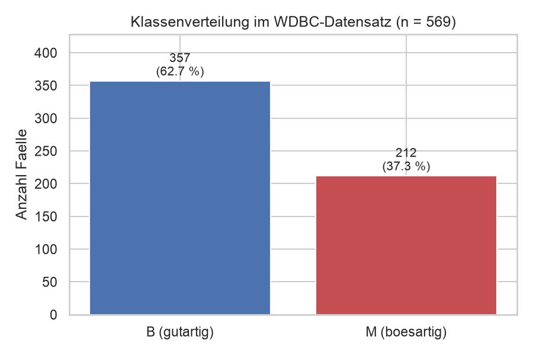
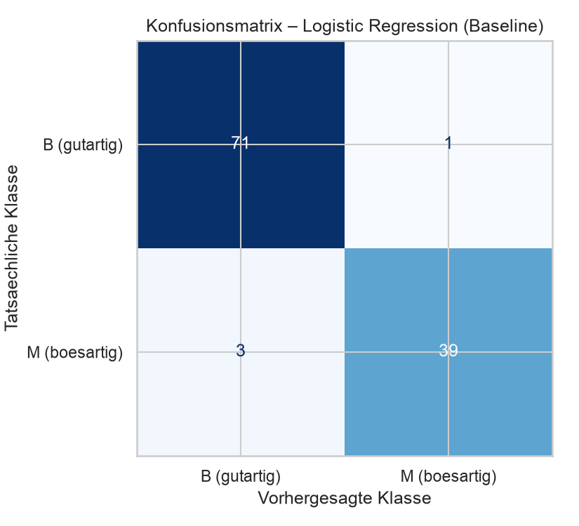
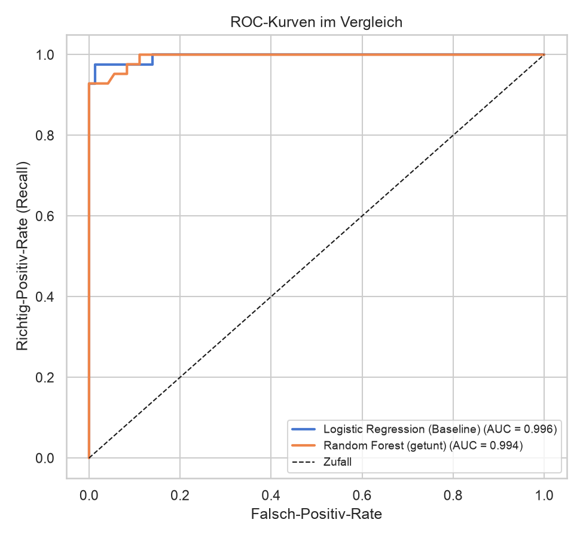
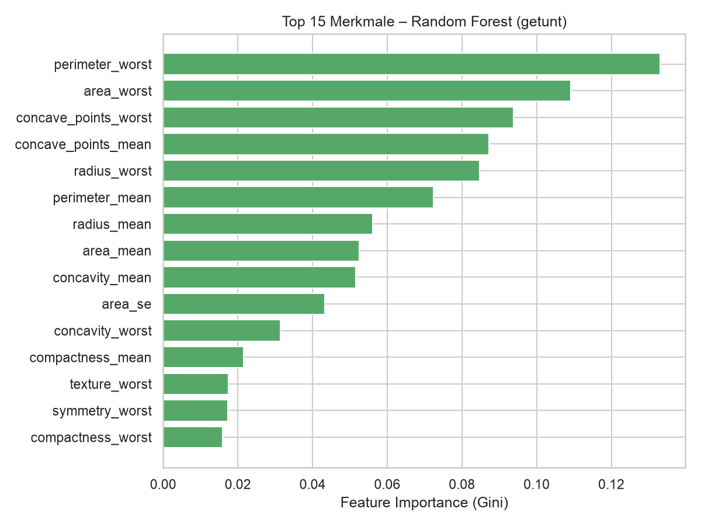

# Klassifikation von Brusttumoren – WDBC-Datensatz

Ein Machine-Learning- und Datenanalyse-Projekt zum **Wisconsin Diagnostic
Breast Cancer (WDBC)** Datensatz. Ziel ist es, aus 30 numerischen Merkmalen
von Zellkernen vorherzusagen, ob ein Brusttumor **gutartig (benign)** oder
**bösartig (malignant)** ist.

Das Projekt entstand im Rahmen der Fächer **Maschinelles Lernen** sowie
**Datenstatistik und -analyse** und verbindet deskriptive Statistik,
Visualisierung und überwachtes Lernen. Die zentrale Bewertungsmetrik ist der
**F1-Score**.



---

## Inhaltsverzeichnis

- [Ergebnisse](#ergebnisse)
- [Datensatz](#datensatz)
- [Projektstruktur](#projektstruktur)
- [Installation](#installation)
- [Nutzung](#nutzung)
- [Methodik](#methodik)
- [Schriftlicher Bericht](#schriftlicher-bericht)
- [Quellen](#quellen)

---

## Ergebnisse

Zwei Modelle werden trainiert und auf einem separaten Testset (114 Fälle)
bewertet:

| Metrik    | Logistic Regression | Random Forest |
|-----------|:-------------------:|:-------------:|
| Accuracy  | 0,9649              | 0,9561        |
| Precision | 0,9750              | 1,0000        |
| Recall    | 0,9286              | 0,8810        |
| **F1-Score** | **0,9512**       | 0,9367        |
| ROC-AUC   | 0,9960              | 0,9942        |

Beide Modelle erreichen sehr hohe Werte. Da der Datensatz nahezu **linear
trennbar** ist, übertrifft die einfachere Logistische Regression den Random
Forest beim F1-Score knapp – ein lehrreiches Ergebnis, das im Bericht
diskutiert wird.

<p align="center">
  
  
</p>

Die wichtigsten Merkmale sind Größen- und Formmerkmale der Zellkerne
(`perimeter_worst`, `area_worst`, `concave_points_worst` …):



---

## Datensatz

- **Quelle:** University of Wisconsin (Wolberg, Street, Mangasarian, 1995),
  UCI Machine Learning Repository
- **Umfang:** 569 Fälle, 30 Merkmale, keine fehlenden Werte
- **Klassen:** 357 gutartig (B) / 212 bösartig (M)
- **Merkmale:** Für jeden Zellkern werden 10 Basismerkmale (radius, texture,
  perimeter, area, smoothness, compactness, concavity, concave points,
  symmetry, fractal dimension) in drei Varianten berechnet: `_mean`, `_se`
  (Standardfehler) und `_worst` → 30 Merkmale.

Die Rohdaten liegen unter [`data/wdbc.data`](data/wdbc.data), die
Merkmalsbeschreibung unter [`data/wdbc.names`](data/wdbc.names).

---

## Projektstruktur

```
PythonProject2MAL/
├── data/
│   ├── wdbc.data              # Rohdaten (569 Fälle)
│   └── wdbc.names             # Merkmalsbeschreibung
├── src/
│   ├── data_loader.py         # Laden & Aufbereiten der Daten
│   ├── eda.py                 # Explorative Datenanalyse + Statistik-Plots
│   ├── model.py               # Modelle, Cross-Validation, Tuning
│   ├── evaluate.py            # Metriken (F1 etc.) + Ergebnis-Plots
│   └── main.py                # Vollständige Pipeline (Einstiegspunkt)
├── report/
│   ├── build_report.py        # Erzeugt den Word-Bericht aus den Ergebnissen
│   └── Projektbericht.docx    # Schriftlicher Bericht (ca. 7–8 Seiten)
├── outputs/
│   ├── figures/               # 10 erzeugte Abbildungen (.png)
│   ├── metrics.json           # Alle Kennzahlen
│   └── descriptive_statistics.csv
├── requirements.txt
└── README.md
```

---

## Installation

Voraussetzung: **Python 3.11**.

```bash
# Repository klonen
git clone <REPO-URL>
cd PythonProject2MAL

# Virtuelle Umgebung anlegen und aktivieren
python -m venv .venv
source .venv/bin/activate        # Windows: .venv\Scripts\activate

# Abhängigkeiten installieren
pip install -r requirements.txt
```

### In PyCharm

1. Projekt öffnen (`File → Open` → Projektordner wählen).
2. PyCharm erkennt `.venv` automatisch, andernfalls unter
   `Settings → Project → Python Interpreter` die `.venv` auswählen.
3. `src/main.py` mit Rechtsklick → **Run 'main'** ausführen.

---

## Nutzung

**1) Vollständige Analyse-Pipeline ausführen** (erzeugt alle Plots und
Kennzahlen in `outputs/`):

```bash
python src/main.py
```

**2) Word-Bericht aus den Ergebnissen erzeugen** (setzt Schritt 1 voraus):

```bash
python report/build_report.py
```

Einzelne Module lassen sich auch direkt starten, z. B. nur die EDA:

```bash
cd src && python eda.py
```

---

## Methodik

1. **Datenaufbereitung** – ID entfernen, Zielvariable binär kodieren
   (M = 1, B = 0).
2. **Explorative Datenanalyse** – deskriptive Statistik, Verteilungen,
   Boxplots, Korrelationsmatrix, Korrelation zur Zielvariable, PCA.
3. **Train/Test-Split** – 80/20, stratifiziert (Klassenverhältnis erhalten).
4. **Modellierung** – Pipeline mit `StandardScaler` (kein Data Leakage);
   Baseline: Logistische Regression, Hauptmodell: Random Forest mit
   `GridSearchCV`-Tuning (5-fache CV, F1-optimiert).
5. **Evaluation** – F1-Score im Fokus, ergänzt um Precision, Recall,
   Accuracy, ROC-AUC, Konfusionsmatrix und Feature Importance.

Warum der **F1-Score**? Die Klassen sind unausgewogen, und sowohl
falsch-negative als auch falsch-positive Diagnosen sind teuer. Der F1-Score
(harmonisches Mittel aus Precision und Recall) balanciert beide Fehlerarten
und ist daher aussagekräftiger als die reine Accuracy.

---

## Schriftlicher Bericht

Der vollständige, ca. 7–8-seitige Projektbericht liegt als Word-Dokument vor:
[`report/Projektbericht.docx`](report/Projektbericht.docx). Er enthält
Einleitung, Datensatzbeschreibung, Methodik, EDA-Ergebnisse, Modellierung,
Diskussion und Fazit inklusive aller Abbildungen.

---

## Quellen

- Wolberg, W. H., Street, W. N., Mangasarian, O. L. (1995): *Wisconsin
  Diagnostic Breast Cancer (WDBC)*. UCI Machine Learning Repository.
- Street, W. N., Wolberg, W. H., Mangasarian, O. L. (1993): *Nuclear feature
  extraction for breast tumor diagnosis*. IS&T/SPIE Symposium on Electronic
  Imaging.
- Pedregosa et al. (2011): *Scikit-learn: Machine Learning in Python*. JMLR 12.
